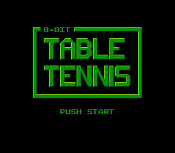
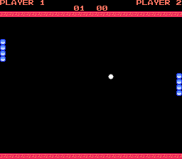

# 8-Bit Table Tennis

8-Bit Table Tennis is a homebrew 2-player game for the Nintendo Entertainment System (NES).

## License

This project may be used under the terms of the MIT license, see [LICENSE](https://github.com/mike42/8bit-table-tennis/blob/master/LICENSE) for details.

It is based on example code by Brad Smith - [bbbradsmith/NES-ca65-example](https://github.com/bbbradsmith/NES-ca65-example).
